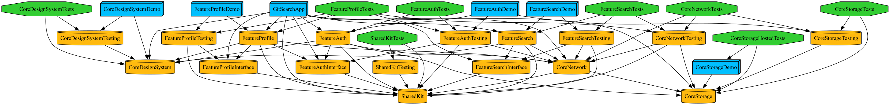

**한국어** | [English](README.en.md)

# TheModularArchitecture-Sample
> Tuist 로컬 플러그인 기반의 Micro Feature Architecture(TMA)를 준수한 iOS 샘플 애플리케이션입니다.
> [iOS-CleanArchitecture-Sample](https://github.com/Jeon0976/iOS-CleanArchitecture-Sample)의 후속 프로젝트로, 같은 앱을 레이어 중심(수평 절단)에서 피처 중심(수직 절단)으로 재구성했습니다.

### 주요 기능
- Github 인증(OAuth)을 통한 로그인 기능
- Github 사용자 검색 및 결과 표시 (페이징 + 아바타 이미지 캐시)
- 개인 정보 조회(캐시 우선 + 새로고침) 및 로그아웃 기능

### 개발 환경
- Tuist 4.133.1 — 로컬 플러그인 4개로 DSL 구성, mise로 버전 고정
- Swift 6.0 (Strict Concurrency `complete`), iOS 16.0

---

## 왜 다시 만들었나

전편(Clean Architecture 버전) README에 적어 두었던 단점이 이 프로젝트의 출발점입니다.

> - **모듈 비대화**: 서비스가 확장됨에 따라 각 레이어 모듈의 크기가 과도하게 커질 수 있다.
> - **테스트 세분화 제한**: 기능이 확장될수록 특정 화면이나 기능 단위로 격리된 테스트를 수행하기 어렵다.

레이어로 자르면 "검색" 하나를 고치는 데 Presentation·Domain·Data 세 모듈을 동시에 수정해야 합니다. 이 레포는 절단 방향을 바꿔 그 문제를 해소합니다.

| 항목 | Clean Architecture (전편) | Micro Feature Architecture (이 레포) |
|:-----|:-------------------------|:------------------------------------|
| 절단 방향 | 수평 — Presentation / Domain / Data 레이어 모듈 | 수직 — FeatureSearch / FeatureAuth / FeatureProfile 피처 모듈 |
| "검색" 코드의 위치 | 3개 레이어 모듈에 분산 | `FeatureSearch` 한 모듈 안에 전부 |
| 피처 간 통신 | Domain 타입 직접 참조 | Interface 타겟(protocol)로만 |
| 의존성 조립 | DIContainer 등록/해소 (런타임) | App의 생성자 주입 (컴파일 타임) |
| 새 기능 추가 | 3개 레이어 모듈 수정 | 모듈 1개 추가, 기존 모듈 무수정 |
| 기능 단위 테스트·실행 | 레이어가 얽혀 어려움 | 피처별 Tests + Demo 앱 단독 실행 |

중요한 점은 Micro Feature가 Clean을 버리는 것이 아니라 **감싼다**는 것입니다. 피처 모듈 내부는 여전히 Composition / Domain / Data / Presentation으로 나뉩니다. 피처 *사이*만 Interface로 통신합니다.

---

## 모듈 구조



모듈 8개, 타겟 31개로 구성됩니다.

```bash
Projects/
├── Shared/SharedKit          # 최하층 공통 — AppError 계층, 유틸
├── Core/
│   ├── CoreNetwork           # URLSession 네트워크 + 인터셉터/모니터 파이프라인
│   ├── CoreStorage           # TokenStorage 계약 + Keychain 구현
│   └── CoreDesignSystem      # Base(MVVM·Coordinator·ManagedTask) + 공용 UI 컴포넌트
├── Feature/
│   ├── FeatureSearch         # 사용자 검색 — 페이징 + 이미지 캐시
│   ├── FeatureAuth           # GitHub OAuth — 토큰의 주인
│   └── FeatureProfile        # 내 프로필 — 유일한 피처 간 의존 (Auth Interface)
└── App/GitSearchApp          # Composition Root — 구현체들이 만나는 유일한 곳
```

### 피처당 5타겟

각 피처는 같은 모양의 타겟 5개로 구성됩니다.

| 타겟 | 제품 | 역할 |
|------|------|------|
| `{Feature}Interface` | 프레임워크 | 밖에 공개하는 계약 — protocol과 전달 모델만 |
| `{Feature}` | 프레임워크 | 구현 — 내부 Composition / Domain / Data / Presentation |
| `{Feature}Testing` | 프레임워크 | Stub·Mock — Tests와 Demo가 재사용 |
| `{Feature}Tests` | 유닛 테스트 | 단위 테스트 |
| `{Feature}Demo` | 앱 | 피처 단독 실행 데모 — DEV(오프라인 Mock) / PROD(실 API) |

### 의존 규칙 3줄

1. 피처끼리는 **Interface로만** 의존한다 
   - 구현 타겟을 서로 모른다.
2. 구현체(`{Feature}ServingImpl`)의 import는 **App만** 할 수 있다.
3. 아래(Core/Shared)는 위(Feature)를 모른다.

규칙이 문서가 아니라 빌드 설정으로 강제됩니다. 예를 들어 FeatureProfile은 FeatureAuth의 **Interface에만** 의존하므로, 구현 타입을 참조하는 코드는 컴파일되지 않습니다.

```swift
// Projects/Feature/FeatureProfile/Project.swift — 구현 타겟의 의존 목록
.implements(
    module: .feature(.FeatureProfile),
    dependencies: [
        .feature(target: .FeatureProfile, type: .interface),
        .shared(target: .SharedKit),
        .core(target: .CoreNetwork),
        .core(target: .CoreDesignSystem),
        .feature(target: .FeatureAuth, type: .interface)   // 유일한 피처 간 의존
    ]
),
```

---

## Tuist 툴링

수직 절단의 대가는 타겟 수입니다(피처 3개 × 5타겟). 그 보일러플레이트를 로컬 플러그인 4개와 DSL로 줄였습니다.

| 플러그인 | 역할 |
|----------|------|
| EnvironmentPlugin | 전역 환경 - 배포 타겟, Swift 설정, 번들 ID 규칙 |
| DependencyPlugin | `ModulePaths` 모듈 레지스트리 + `.feature(target:type:)` 의존 헬퍼 |
| ConfigurationPlugin | DEV/PROD 빌드 설정 + 시크릿 include 경로 |
| TemplatesPlugin | `tuist scaffold` 템플릿 — Feature(5타겟)·Module(일반) 2종 |

- **`Project.module` 팩토리**: 각 모듈의 `Project.swift`는 `.interface / .implements / .testing / .tests / .demo` 타겟 팩토리 호출만으로 구성됩니다. 한 파일에서 타겟 5개와 의존 그래프가 전부 읽힙니다.
- **스킴 자동 생성**: 모듈 스킴 8개 + 실행 스킴 12개(데모 5개와 본 앱 각각 `-DEV` / `-PROD`)가 DSL에서 생성됩니다.
- **새 피처 추가**: `tuist scaffold Feature --name Starred` → `ModulePaths.Feature`에 케이스 1줄 추가 → `tuist generate`. Workspace 프로젝트 목록은 `ModulePaths`의 `allCases`를 순회하므로 별도 수정이 없고, 기존 피처 모듈은 손대지 않습니다.

### 피처 단독 실행 (Demo)

| 실행 스킴 | DEV | PROD |
|-----------|-----|------|
| `FeatureSearchDemo` | 오프라인 목 세션 | 비인증 실 검색 API |
| `FeatureAuthDemo` | 오프라인 목 세션 | 실 OAuth (키 필요) |
| `FeatureProfileDemo` | 오프라인 목 세션 | 실 프로필 (토큰 필요) |
| `CoreDesignSystemDemo` | 공용 컴포넌트 데모 | 〃 |
| `CoreStorageDemo` | 저장 동작 확인 + 호스트 테스트 숙주 | 〃 |
| `GitSearchApp` | 본 앱 (Debug) | 본 앱 (Release) |

DEV 데모는 진짜 화면 로직에 Testing 타겟의 목 네트워크 세션만 갈아 끼운 것입니다. 서버·토큰 없이 페이징, 화면 전환까지 실제 코드가 그대로 돕니다.

---

## 아키텍처 설명

### Composition Root — 생성자 주입

앱 전체의 조립이 `AppContainer` 한 곳에서 일어납니다. 컨테이너에 등록/해소하는 방식 대신 생성자로 직접 주입합니다.

```swift
// Projects/App/GitSearchApp/Sources/AppContainer.swift (요약)
let tokenStorage = KeychainTokenStorage()
let session = NetworkSession(
    interceptors: [
        AuthTokenInterceptor(tokenStorage: tokenStorage),  // 토큰 자동 부착
        TransientErrorRetryInterceptor()                   // 일시 에러 재시도(멱등 요청만)
    ],
    monitors: [NetworkLogger()]
)

let auth = FeatureAuthServingImpl(session: session, tokenStorage: tokenStorage, credentials: credentials)
self.search  = FeatureSearchServingImpl(session: session)
self.profile = FeatureProfileServingImpl(session: session, auth: auth)   // Auth 인스턴스 공유
```

의존성이 빠지면 런타임 크래시가 아니라 **컴파일 에러**입니다.

### 피처 간 경계 — 로그아웃 3분할

로그아웃 하나에 일이 세 가지인데, 각각 주인이 다릅니다.

| 할 일 | 주인 | 방법 |
|-------|------|------|
| 토큰 삭제 | FeatureAuth | `onLogout` 클로저로 위임 |
| 유저 캐시 정리 | FeatureProfile | 자기 UseCase (`ClearCachedUserUseCase`) |
| 화면 전환 | App | `actions.profileDidLogout()` |

전편에서는 앞의 두 가지가 `UserUseCase.logout()` 한 곳에 뭉쳐 있었습니다. 피처로 자르면 "누구의 일인가"가 모듈 경계와 일치하게 됩니다.

### OAuth 딥링크 흐름

`SceneDelegate`가 `findusername://` 콜백을 받아 `AppFlowCoordinator → auth.handleOAuthCallback(url)`로 전달합니다. 코드 파싱(URLComponents)과 토큰 교환·저장은 전부 FeatureAuth 내부의 일이고, App은 URL을 중계만 합니다.

### 장점

- **기능 단위 격리**: 피처별로 테스트하고(Tests), 피처만 단독 실행합니다(Demo) — 전편의 "테스트 세분화 제한"이 해소됩니다.
- **수정 범위 예측**: 검색 코드는 FeatureSearch에만 있습니다. 기능 하나를 고칠 때 건드리는 모듈이 하나입니다.
- **빌드 병렬화**: 피처끼리 서로 모르므로 병렬 빌드가 가능합니다.
- **결합의 가시화**: 피처 간 의존이 `Project.swift`의 `.interface` 한 줄로 드러납니다.

### 단점

- **타겟 수 증가**: 모듈 8개에 타겟 31개 — 스캐폴드 템플릿으로 생성 비용은 줄였지만, 구조 자체의 러닝커브가 있습니다.
- **Interface 계약 관리**: 계약이 바뀌면 의존하는 피처와 Testing의 Stub까지 함께 갱신해야 합니다.
- **소규모 앱에는 과함**: 화면 3개짜리 앱 기준으로는 장치가 많습니다. 이 레포는 구조 학습이 목적이라 감수했습니다.

---

## Clean 대비 개선점

아키텍처 절단 외에, 전편에서 아쉬웠던 부분들을 이식하면서 함께 고쳤습니다.

| 항목 | Clean (전편) | 이 레포 |
|------|-------------|---------|
| 의존성 조립 | DIContainer 등록/해소 — 미등록이 런타임에야 발견 | Composition Root 생성자 주입 - 미주입은 컴파일 에러 |
| 토큰 저장소 | UserDefaults 저장 | Keychain 구현 + 계약 테스트·호스트 테스트 |
| 토큰 사용 | UseCase가 토큰을 꺼내 파라미터로 전달 | 인터셉터가 요청에 자동 부착 - 사용처는 토큰의 존재를 모름 |
| UseCase 단위 | `GithubTokenUseCase` 하나에 동사 4개 | 동사별 분리 - Auth 4개·Profile 3개·Search 2개 |
| 로그아웃 | UseCase가 토큰+유저 캐시 동시 삭제 | 3분할 - 토큰은 Auth, 캐시는 Profile, 화면 전환은 App |
| 동시성 | Swift 5, 비구조화 `Task { }` | Swift 6 strict `complete`, `ManagedTask`(재진입·deinit 취소 규율), Sendable 경계 |
| 에러 | 레이어별 개별 Error | `AppError` 계층 래핑 + 사용자 메시지 분리 |

---

## 주요 기능 설명

### Github 인증 (FeatureAuth)
- Interface 계약은 4개입니다: `isLoggedIn` / `makeLoginViewController` / `handleOAuthCallback` / `logout`.
- 인증 URL 생성 > 외부 브라우저 > 딥링크 콜백 > 코드 교환 > Keychain 저장이 전부 피처 내부에서 끝납니다.
- OAuth 키(Client ID/Secret)가 없으면 에러 대신 **설정 방법 안내**를 띄웁니다 — 클론해서 바로 실행해도 막히지 않습니다.

### 사용자 검색 (FeatureSearch)
- `SearchUsersUseCase`가 페이지 단위 검색을, `FetchProfileUseCase`가 아바타 이미지를 담당합니다.
- 이미지는 캐시를 거쳐 재사용되며, Repository 테스트가 캐시 히트 시 네트워크 미발생을 검증합니다.

### 프로필 (FeatureProfile)
- 조회 경로가 둘입니다: `FetchUserUseCase`(캐시 우선)와 `RefreshUserUseCase`(캐시 무시) - 화면 재진입,당겨서 새로고침 시 값이 세션 내내 고정되는 문제를 막습니다.
- 유일한 피처 간 의존(Auth Interface)의 실물이자, 로그아웃 3분할의 주인공입니다.

### 테스트 (24개)
- **계약 테스트**: `TokenStorage` 계약을 In-memory Mock과 실제 Keychain 구현이 같은 시험으로 통과합니다. Keychain은 호스트 앱이 필요하여 `CoreStorageHostedTests`로 분리했습니다.
- **라우팅 스텁**: `StubNetworkRequesting`이 결과 주입과 요청 기록(`requestedEndpoints`)을 지원해 Repository가 어떤 엔드포인트를 몇 번 불렀는지까지 검증합니다.
- `ManagedTask`(재진입 취소·단일 비행) 동작 테스트 5개가 Core에 있습니다.

---

## 실행 방법

```bash
mise install                                    # Tuist 4.133.1 설치
cp Secrets.xcconfig.template Secrets.xcconfig   # (선택) OAuth 키 — 없어도 빌드·실행됩니다
tuist install
tuist generate                                  # 워크스페이스 생성 + Xcode 열기
tuist test                                      # 테스트 24개
```

- OAuth 로그인까지 확인하려면 GitHub OAuth App을 만들어 `Secrets.xcconfig`에 `GITHUB_CLIENT_ID` / `GITHUB_CLIENT_SECRET`을 채웁니다 (callback: `findusername://callback`). 실제 키 파일은 gitignore 대상이며 템플릿만 커밋되어 있습니다.
- 시크릿은 xcconfig > 빌드 설정 > Info.plist `$(변수)` > `Bundle` 경로로 앱에 주입됩니다. 피처는 값만 받을 뿐 출처를 모릅니다.

## 기술 스택

- 비동기 처리: Swift Concurrency (Domain·Data) + Combine (Presentation MVVM Input/Output)
- 사용 패턴: MVVM, Coordinator(actions 위임), Composition Root 생성자 주입
- 네트워크: URLSession 자체 구현 + 인터셉터(토큰 부착·재시도)/모니터(로깅) 파이프라인
- 저장소: Keychain (TokenStorage 계약 기반)
- 모듈화: Tuist 4.133.1 로컬 플러그인 + scaffold 템플릿
